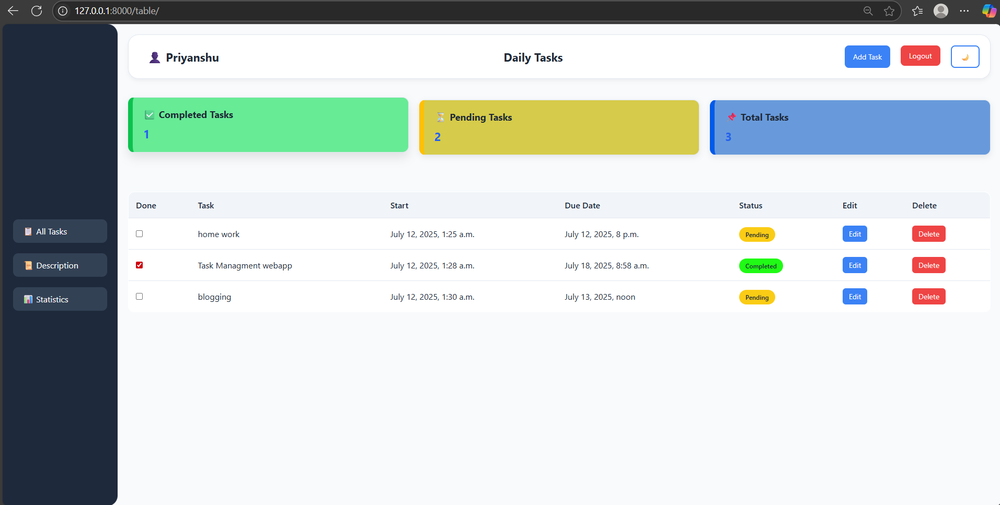
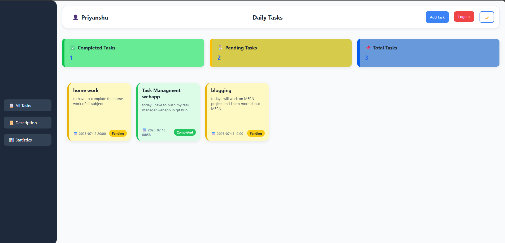
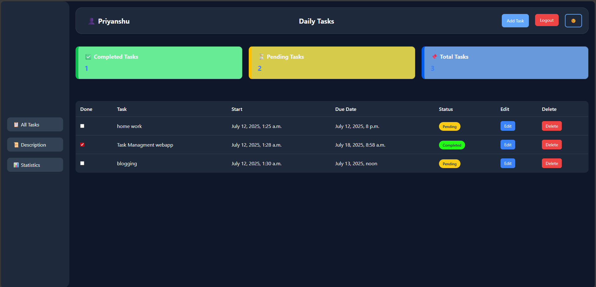
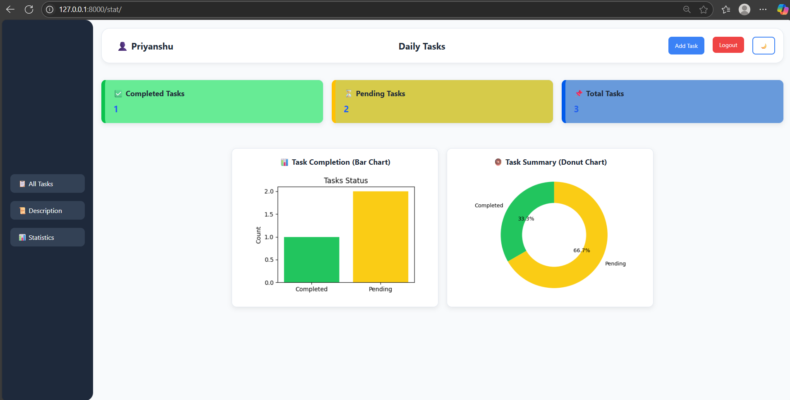

# 📝 Task Manager

A Django-based Task Management Web App with:

- OTP-based Signup
- Task CRUD (Create, Read, Update, Delete)
- Task statistics with Pie Chart
- Dark Mode Toggle
- Responsive UI

## 🔧 Tech Stack
- Django
- HTML/CSS
- Chart.js

## 📸 Screenshots

### Home Page


### DISCRIPTIONS OF ALL TASKS


### Dark Mode


### statistics


## 🚀 Getting Started

```bash
git clone https://github.com/yourusername/taskmanager.git
cd taskmanager
pip install -r requirements.txt
python manage.py runserver
